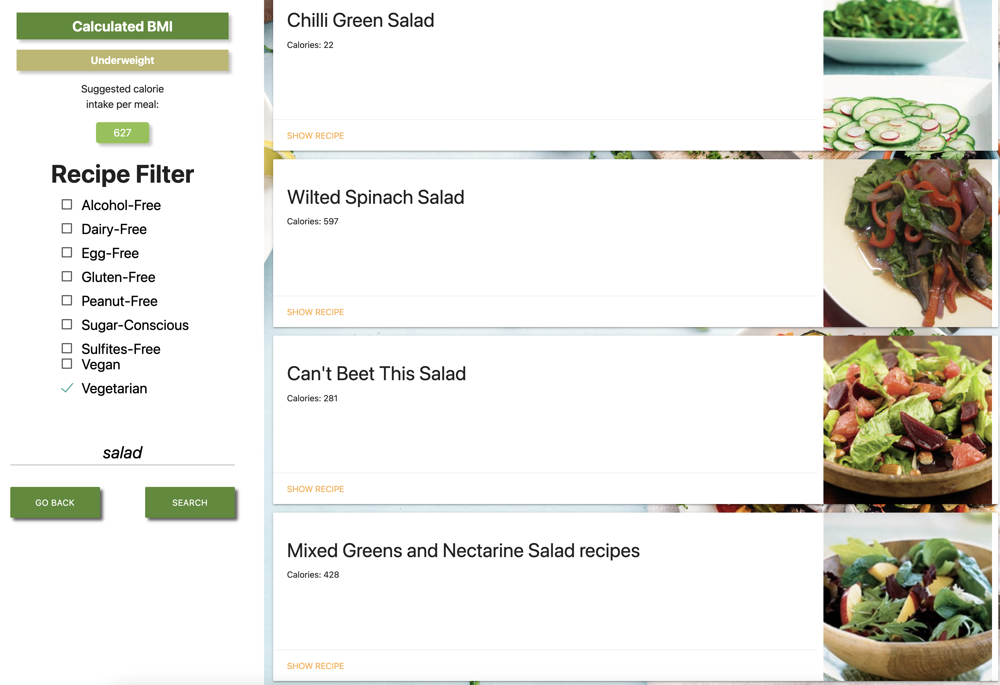
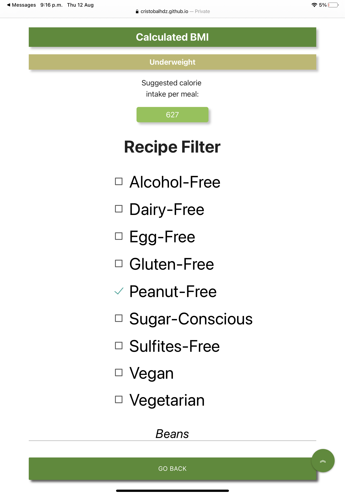
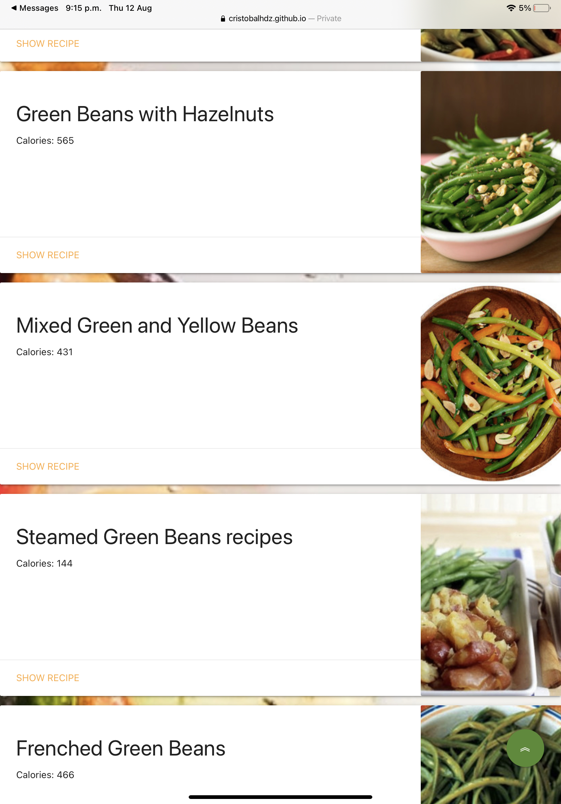

# Boot Camp First Project
 <h1>NUTRICIPY</h1>

# Team Members
## - Karen Villagomez
## - Aaron Marquez
## - Carlos Paez
## - Cristobal Hernandez

 

Published link: `https://cristobalhdz.github.io/Nutricipy/`

# Section 01: Description
This application will use a Body Mass Index(BMI) API to calculate the suggested calorie intake, this information will be used with a diet API that will display recipes based on their recommended threshold. The application will receive individual filters to narrow the results displaying in an easy to use interface.

The goal of this application is to help the user keep track of their diet based on their personal life needs and dietary restrictions providing them a wide variety of nutritional options. This way the user can expand their menu without sacrificing their well being but yet enjoying appetizing flavourful options.

# Section 02: Technologies used
`JavascriptFramework`
 
    a) jQuery
 

`CSS Framework`
 
    a) jQuery
 

`Third Party APIs`
 
    a) Recipe search and diet API(powered by Edamam)
     
    b) Body Mass Index (BMI) Calculator API(powered by Principal APIs)***Compare BMI against age group or additional resource
 

`Deplyment`
 
a)Github

# Section 03: Screenshot

## `Main Page`
 

## `Search Page`
 

## `Search page looking up some recipes`
 

## `Search page looking up some recipes`
 

## `Search page looking up some recipes in mobile`
 

## References
`Materialize`:
 
https://materializecss.com/

`Radio button`:
 
https://codepen.io/Metty/pen/MWjOavR

`Rapid API BMI`:
 
https://fitness-calculator.p.rapidapi.com/

`Edamam API for recipes`:
 
https://edamam-recipe-search.p.rapidapi.com